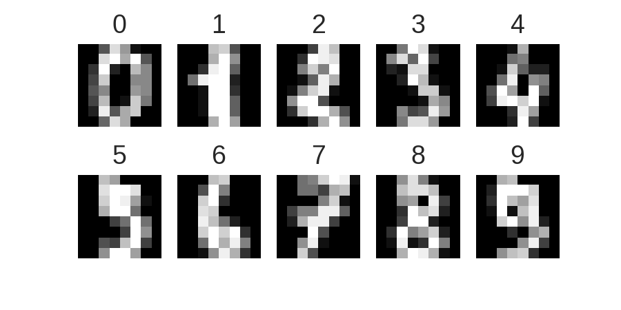

# Hand Written Digits Recognition

## Problem Statement:
Create the model that can identify the hand written digits.

## Problem solving:
- Create the dataset
- Build the model
- Train the model
- Make predictions

## Digits:
Digits can be 0,1,2,3,4,5,6,7,8,9.

## Solutions by Different Algorithms
 - SVM
 - Random Forest
 - Logistic Regression
 - KMeans Clustering
